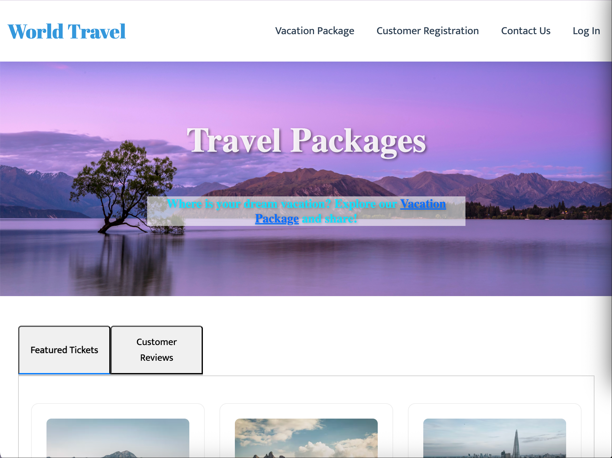

# Travel Booking Portal - Web Application

## 📖 Overview

**Travel Booking Portal** is a full-featured travel booking system that allows users to explore vacation packages, make bookings, and manage their travel plans. Built with modern web technologies, this application provides a seamless user experience for planning dream vacations.

## 🌐 Live Demo

Visit the live application: [https://travel-booking-portal.onrender.com](https://travel-booking-portal.onrender.com)

## ✨ Features

### 🏨 **Package Management**

- Browse detailed vacation packages with destinations, pricing, and availability
- Filter packages by destination, price range, and dates
- View comprehensive package details including amenities and inclusions

### 👤 **User Authentication**

- Secure user registration and login system
- Protected user profiles with booking history
- Session management and secure password handling

### 🛒 **Booking System**

- Real-time availability checking
- Multiple travelers booking support
- Booking confirmation and receipt generation
- Edit/cancel existing bookings

### 🎨 **Responsive Design**

- Mobile-first responsive design
- Intuitive user interface
- Cross-browser compatibility
- Fast loading performance

## 🛠️ Technology Stack

### **Frontend**

- HTML5 & CSS3 for structure and styling
- JavaScript (ES6+) for interactivity
- Bootstrap 5 for responsive components
- Font Awesome icons

### **Backend**

- C# .NET Core for server-side logic
- ASP.NET MVC framework
- Entity Framework Core for ORM

### **Database**

- MySQL for data persistence
- Optimized queries for performance
- Secure data storage practices

### **Deployment**

- Render cloud platform hosting
- Continuous deployment setup
- SSL/TLS encryption

## 📱 Key Pages

1. **Home Page** - Welcome and introduction to travel services
2. **Vacation Packages** - Browse all available travel packages
3. **Customer Registration** - User account creation
4. **Contact Us** - Get in touch with customer support
5. **Login** - Secure authentication portal

## 🎯 Project Goals

This project demonstrates:

- Full-stack web development capabilities
- Database design and management
- User authentication implementation
- Responsive web design principles
- Clean code architecture and organization

## 🔧 Development Setup

### Prerequisites

- .NET SDK 6.0+
- MySQL Server
- Visual Studio or VS Code
- Git

### Installation Steps

1. Clone the repository
2. Configure database connection string
3. Run database migrations
4. Build and run the application

## 📊 Database Schema

The application uses a relational database with tables for:

- Users (Customers)
- Vacation Packages
- Bookings
- Package Suppliers
- Agents

## 🚀 Performance Optimizations

- **Lazy Loading** for large datasets
- **Caching** for frequently accessed data
- **Compressed Assets** for faster loading
- **Optimized Images** with proper sizing
- **Minified CSS/JS** for production

## 🔒 Security Features

- **Password Hashing** using industry-standard algorithms
- **SQL Injection Prevention** via parameterized queries
- **XSS Protection** with input sanitization
- **Session Security** with proper timeout handling
- **HTTPS Enforcement** for all communications

## 📈 Future Enhancements

Planned features for future releases:

- Payment gateway integration
- Email notification system
- User reviews and ratings
- Social media sharing
- Advanced search filters
- Multi-language support
- Mobile app version

## 👥 Target Audience

- Travel enthusiasts looking for vacation packages
- Travel agencies managing bookings
- Individual travelers planning trips
- Students learning full-stack development

## 🏆 Key Achievements

1. **Complete CRUD Operations** - Create, Read, Update, Delete functionality
2. **User Authentication** - Secure login and registration system
3. **Responsive UI** - Works seamlessly on all devices
4. **Database Integration** - Efficient data management
5. **Production Deployment** - Live application with real users

## 📞 Contact & Support

For technical issues or questions about the application:

- **Website**: [https://travel-booking-portal.onrender.com](https://travel-booking-portal.onrender.com)
- **GitHub Repository**: [View Source Code](https://github.com/Xavier030/Travel-Booking-Portal)

## 📄 License

This project is developed as part of a portfolio demonstration. All travel packages and images are for demonstration purposes only.

---

**"Where is your dream vacation? Explore our Vacation Package and share!"**

_Built with passion for travel and technology_ ✈️💻
